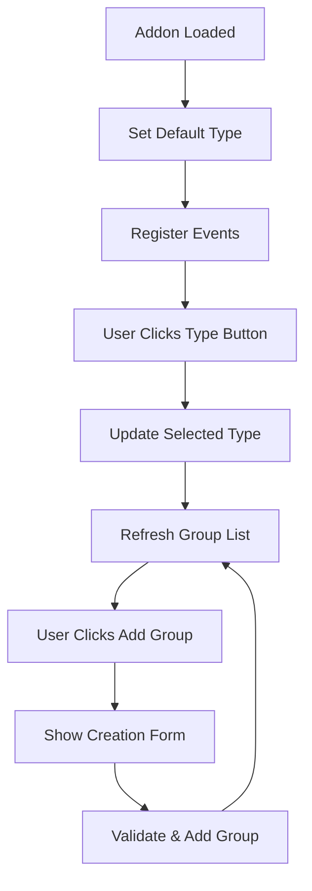

# GroupFinder Enhanced

Un addon GroupFinder amélioré pour World of Warcraft 1.12 (Vanilla) avec de nombreuses fonctionnalités avancées.

## Nouvelles Fonctionnalités

### 🔧 Corrections majeures

- ✅ Correction de l'API obsolète (event handlers WoW 1.12)
- ✅ Correction de la gestion des canaux de chat
- ✅ Correction du XML malformé
- ✅ Gestion d'erreurs robuste

### 🚀 Fonctionnalités ajoutées

- **Persistance des données** : Les groupes sont sauvegardés entre les sessions
- **Nettoyage automatique** : Suppression automatique des groupes expirés (1 heure par défaut)
- **Interface améliorée** : Labels, tooltips, boutons de fermeture
- **Validation des entrées** : Vérification des champs obligatoires et limites de caractères
- **Commandes slash étendues** : Plus d'options de gestion
- **Reconnexion automatique** : Rejoint automatiquement le canal LFG si déconnecté
- **Gestion des doublons** : Évite les groupes en double du même leader
- **Tooltips informatifs** : Informations détaillées au survol des groupes
- **Horodatage** : Affichage de l'âge des annonces de groupe

## Commandes

### Commandes slash

- `/groupfinder` ou `/gf` - Ouvre/ferme la fenêtre principale
- `/gf clear` - Supprime vos propres groupes
- `/gf clearall` - Supprime tous les groupes
- `/gf cleanup` - Force le nettoyage des groupes expirés
- `/gf help` - Affiche l'aide des commandes

### Interface utilisateur

- **Créer un groupe** : Bouton pour ouvrir la fenêtre de création
- **Actualiser** : Actualise manuellement la liste des groupes
- **Nettoyer** : Supprime les groupes expirés
- **Effacer mes groupes** : Supprime uniquement vos annonces

## Utilisation

1. **Installation** : Placez le dossier dans `Interface/AddOns/`
2. **Première utilisation** : L'addon rejoint automatiquement le canal "LookingForGroup"
3. **Créer un groupe** :
   - Cliquez sur "Create Group"
   - Cliquez sur le bouton d'instance pour sélectionner dans la liste
   - Remplissez les rôles nécessaires
   - Ajoutez une description optionnelle
   - Cliquez "Create Group"
4. **Filtrer les groupes** : Utilisez les boutons All, Dungeon, Raid, PvP, Other
5. **Rejoindre un groupe** : Cliquez sur une annonce pour chuchoter au leader
6. **Gestion** : Utilisez les boutons pour nettoyer et gérer vos annonces

## Configuration

L'addon sauvegarde automatiquement ses paramètres dans `GroupFinderDB` :

```lua
GroupFinderDB = {
    groups = {}, -- Liste des groupes
    settings = {
        autoCleanup = true,    -- Nettoyage automatique activé
        cleanupTimer = 3600,   -- Durée avant expiration (secondes)
        maxGroups = 50         -- Nombre maximum de groupes stockés
    }
}
```

## Fonctionnalités techniques

### Gestion des canaux

- Rejoint automatiquement le canal "LookingForGroup"
- Reconnexion automatique en cas de déconnexion
- Gestion correcte des numéros de canaux

### Persistance

- Sauvegarde automatique des groupes
- Nettoyage périodique (toutes les 5 minutes)
- Limitation du nombre de groupes stockés

### Interface

- Fenêtres redimensionnables et déplaçables
- Tooltips avec informations détaillées
- Validation des entrées en temps réel
- Messages d'erreur colorés

### Performance

- Gestion optimisée des boutons d'interface
- Nettoyage automatique de la mémoire
- Timer de mise à jour efficace

## Changelog

### Version 2.0

- Refonte complète du code
- Correction de tous les bugs majeurs
- Ajout de nombreuses nouvelles fonctionnalités
- Interface utilisateur complètement redessinée
- Système de persistance des données
- Nettoyage automatique des groupes expirés

### Version 0.1 (Originale)

- Fonctionnalité de base de recherche de groupe
- Interface simple
- Pas de persistance

## Support

Cet addon est compatible avec World of Warcraft 1.12 (Vanilla).

## Crédits

- Version originale : YourName
- Version améliorée : Enhanced by Roo
- Compatible avec WoW 1.12 Vanilla

## XML Structure Outline for Two-Panel Layout

```xml
<Frame name="GroupFinderMainFrame" parent="UIParent" toplevel="true" movable="true" enableMouse="true" hidden="false">
  <Size>
    <AbsDimension x="600" y="400"/>
  </Size>
  <Anchors>
    <Anchor point="CENTER"/>
  </Anchors>
  <!-- Left Panel: Instance Type Selection -->
  <Frame name="GroupFinderLeftPanel">
    <Size>
      <AbsDimension x="120" y="400"/>
    </Size>
    <Anchors>
      <Anchor point="TOPLEFT"/>
    </Anchors>
    <!-- 4 Vertical Buttons -->
    <Button name="GFButtonDungeon" inherits="UIPanelButtonTemplate">
      <Size><AbsDimension x="100" y="40"/></Size>
      <Anchors><Anchor point="TOPLEFT" x="10" y="-20"/></Anchors>
      <Text>DUNGEON</Text>
    </Button>
    <Button name="GFButtonRaid" inherits="UIPanelButtonTemplate">
      <Size><AbsDimension x="100" y="40"/></Size>
      <Anchors><Anchor point="TOPLEFT" relativeTo="GFButtonDungeon" x="0" y="-50"/></Anchors>
      <Text>RAID</Text>
    </Button>
    <Button name="GFButtonPvP" inherits="UIPanelButtonTemplate">
      <Size><AbsDimension x="100" y="40"/></Size>
      <Anchors><Anchor point="TOPLEFT" relativeTo="GFButtonRaid" x="0" y="-50"/></Anchors>
      <Text>PVP</Text>
    </Button>
    <Button name="GFButtonOther" inherits="UIPanelButtonTemplate">
      <Size><AbsDimension x="100" y="40"/></Size>
      <Anchors><Anchor point="TOPLEFT" relativeTo="GFButtonPvP" x="0" y="-50"/></Anchors>
      <Text>OTHER</Text>
    </Button>
  </Frame>
  <!-- Right Panel: Dynamic Content Area -->
  <Frame name="GroupFinderRightPanel">
    <Size>
      <AbsDimension x="480" y="400"/>
    </Size>
    <Anchors>
      <Anchor point="TOPLEFT" relativeTo="GroupFinderLeftPanel" relativePoint="TOPRIGHT" x="0" y="0"/>
    </Anchors>
    <!-- Dynamic content: group list or creation form goes here -->
    <!-- "Add Group" button at bottom -->
    <Button name="GFButtonAddGroup" inherits="UIPanelButtonTemplate">
      <Size><AbsDimension x="120" y="40"/></Size>
      <Anchors>
        <Anchor point="BOTTOMRIGHT" x="-20" y="20"/>
      </Anchors>
      <Text>ADD GROUP</Text>
    </Button>
  </Frame>
</Frame>
```

- All panels and buttons use absolute positioning.
- Right panel content is dynamic (group list or creation form).
- Button and frame names are for reference; actual implementation may adjust for WoW 1.12 XML syntax.

## Lua Module/Component Responsibilities and Flow

**Responsibilities:**

- `GroupFinder.lua` main module:
  - Handles initialization, event registration, and frame show/hide logic.
  - Manages state: selected type (Dungeon/Raid/PvP/Other), current group list, and form visibility.
  - Updates right panel content based on left panel selection.
  - Handles "Add Group" button logic and form submission.
  - Filters group data by selected type.
  - Preserves and integrates existing group management, chat, and debug logic.

**Component Flow:**

1. **Addon Load:**

   - Initialize frames, set Dungeon as default selection.
   - Register events for group updates, chat, and debug.

2. **Panel Switching:**

   - On left panel button click, update selected type.
   - Call function to refresh right panel with filtered group list.

3. **Group List Display:**

   - Populate right panel with groups matching selected type.
   - Show "Add Group" button at bottom.

4. **Group Creation:**

   - On "Add Group", show creation form filtered by type.
   - On submit/validation, add group, refresh list, return to group list view.

5. **State Management:**
   - Maintain current selection and UI state.
   - Ensure compatibility with WoW 1.12 event and frame APIs.

**Flow Diagram:**



## Notes on Preserving Existing Features and Debug Tools

- **Group Management:**

  - Retain all logic for group creation, editing, deletion, and listing.
  - Ensure new filtering and panel logic integrates with existing group data structures.
  - Maintain compatibility with WoW 1.12 event-driven updates.

- **Chat Integration:**

  - Preserve all chat message handling, announcements, and group recruitment messages.
  - Ensure chat hooks remain functional regardless of panel state.

- **Debug Tools:**

  - Retain all debug output, logging, and developer commands.
  - Ensure debug UI (if any) is accessible and not hidden by new layout.
  - Keep debug toggles and verbose output options.

- **General:**
  - Avoid breaking changes to saved variables or user settings.
  - Test all legacy features after refactor to confirm no regressions.
  - Use absolute positioning for new frames, but keep relative positioning where required by WoW 1.12 API.
